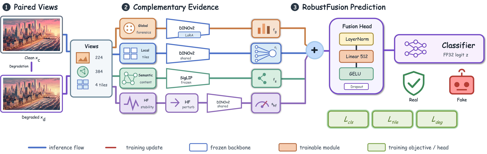
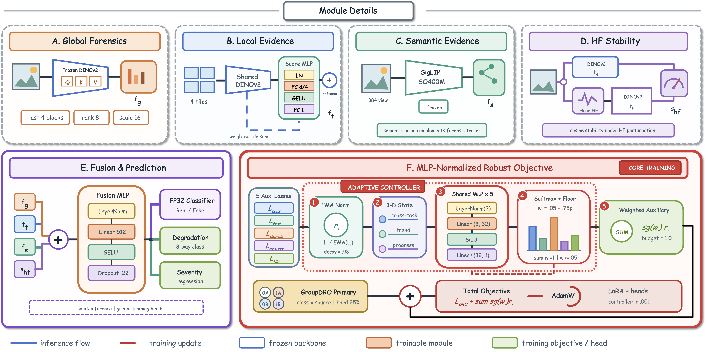

# RobustFusion


> **Robust Detection of AI-Generated Images Under Real-World Transformations**




---

A multi-evidence AI-generated content (AIGC) detector developed for TikTok TechJam 2026 — Challenge 5. The system combines complementary forensic, local, semantic, and high-frequency evidence while explicitly training for robustness to compression, blur, resizing, noise, color adjustment, and cropping.

## Table of Contents

- [🚀 Quick Start](#quick-start)
- [📁 Project Structure](#project-structure)
- [🏗️ Architecture](#architecture)
  - [Four Evidence Branches](#four-evidence-branches)
  - [Joint Fusion](#joint-fusion)
  - [Training Objectives](#training-objectives)
  - [Parameters](#parameters)
  - [Explanation Layer](#explanation-layer-inference-only)
- [📊 Performance](#performance)
- [✨ Key Features](#key-features)
- [🛠️ Development](#development)
  - [Model Training](#model-training)
  - [Frontend Development](#frontend-development)
  - [API Endpoints](#api-endpoints)
- [🧰 Technical Stack](#technical-stack)
- [👥 Team](#team)
- [📜 License](#license)

---

## 🚀 Quick Start

```bash
# Clone the repository
git clone https://github.com/your-repo/404BrainNotFound.git
cd 404BrainNotFound

# Start the local demo (requires Python 3.10-3.12)
cd model
pip install -r requirements.txt
PYTHONPATH=src python scripts/serve_demo.py --device auto --port 8000

# In another terminal, start the frontend
cd frontend
pnpm install
NEXT_PUBLIC_API_BASE_URL=http://127.0.0.1:8000 pnpm dev
```

Open http://localhost:3000 to use the interactive demo.

## 📁 Project Structure

```
404BrainNotFound/
├── model/                  # PyTorch model, training, and inference
│   ├── checkpoint/         # Trained checkpoints and calibration
│   ├── configs/            # Training configurations
│   ├── results/            # Experiment results and reports
│   ├── scripts/            # Data prep, demo, evaluation scripts
│   ├── src/aigc_detector/ # Core training and inference code
│   ├── docs/               # Architecture and experiment docs
│   └── MODEL_ARCHITECTURE.svg  # Architecture diagram
├── frontend/               # Next.js interactive demo
├── val_data/               # External validation dataset management
├── docs/                   # Project documentation
└── scripts/               # Setup and utility scripts
```

## 🏗️ Architecture

RobustFusion is a joint-fusion detector that combines four evidence branches.

### Four Evidence Branches

| Branch | Backbone | Input | Output | Role |
|--------|----------|-------|--------|------|
| **Global** | DINOv2 ViT-B/14 (frozen + LoRA) | 224×224 bicubic resize | 768-D embedding | Global forensic features |
| **Local** | DINOv2 ViT-B/14 (shared backbone) | 4 corner tiles 224×224 | 768-D (attention-pooled) | Local patch evidence |
| **Semantic** | SigLIP SO400M/14 (frozen) | 384×384 | 1152-D embedding | Semantic consistency |
| **High-frequency** | Haar-like perturbation | 224×224 global view | 1-D cosine similarity | Perturbation stability |

### Joint Fusion

The four signals are concatenated and passed through a fusion MLP:

```
[global 768-D] + [tile-pooled 768-D] + [semantic 1152-D] + [wavelet 1-D]
                            ↓
                    LayerNorm → Linear → GELU → Dropout → 512-D
                            ↓
                    Binary classifier → raw logit → sigmoid
```

### Training Objectives

- **Primary**: Class/Source GroupDRO with symmetric hard-example mining and real/fake risk-gap term
- **Auxiliary tasks** (5 heads, EMA-normalized losses via shared MLP):
  - Degradation classifier (8 classes)
  - Degradation severity regressor
  - Global consistency head
  - Tile auxiliary logits
  - Wavelet stability head

```
L = L_primary + Σᵢ stop_gradient(wᵢ) × Lᵢ / EMA(Lᵢ)
```

Where the MLP assigns positive simplex weights based on relative difficulty.

### Parameters

| Component | Count |
|-----------|-------|
| Total parameters | 515,587,535 |
| Trainable (LoRA + heads) | 1,637,007 |
| Frozen backbones | 513,950,528 |

**Only 1.64M of 515.59M parameters are trainable**, keeping the system under the 2B-parameter constraint.

### Explanation Layer (Inference-only)

Not part of the model checkpoint, but used for interpretability:

- **Hierarchical region occlusion**: Coarse grid → top-K local refinement with raw-logit + probability deltas
- **Input high-frequency strength**: |image − GaussianBlur(image)| — checkpoint-independent diagnostic
- **Wavelet-only counterfactual**: Suppress HF locally, fix all other fusion features
- **Robustness trajectory**: 16 prescribed transform conditions (JPEG, blur, resize, noise, color, crop)

## 📊 Performance

| Test Set | Clean AUROC | Mean AUROC (16 transforms) |
|----------|-------------|---------------------------|
| COCO/DALL-E 3 | 98.96% | 98.34% |
| COCO/MidJourney | 94.39% | 93.19% |

| Metric | Value |
|--------|-------|
| Internal validation AUROC | 88.07% |
| Training epochs | 6 |
| Batch size | 192 |
| Base learning rate | 1.5×10⁻⁴ |
| LoRA learning rate | 3×10⁻⁵ |
| Training time (H100 NVL MIG 3g.47GB) | 57m24s |
| End-to-end time | 79m10s |

## ✨ Key Features

| Feature | Description |
|---------|-------------|
| 🔄 16 Transforms | JPEG compression, Gaussian blur, resizing, noise, color adjustment, center crop |
| 📈 Platt Calibration | Probability calibration on isolated validation split |
| 🔍 Counterfactual | Patch-level and branch-level attribution |
| ⚡ FastAPI Backend | Local inference with progressive 16-condition scanning |
| 🎨 Interactive UI | Upload images, view comparisons, explore explanations |

## 🛠️ Development

### Model Training

```bash
cd model
pip install -r requirements.txt
export PYTHONPATH="$PWD/src"

# Smoke test
PYTHONPATH=src python -m aigc_detector.train \
  --config configs/hybrid_759921_mlp_controller_h100_smoke.yaml --max-steps 3

# Full training
PYTHONPATH=src python -m aigc_detector.train \
  --config configs/hybrid_759921_mlp_controller_h100.yaml
```

### Frontend Development

```bash
cd frontend
pnpm install
NEXT_PUBLIC_API_BASE_URL=http://127.0.0.1:8000 pnpm dev
```

### API Endpoints

| Endpoint | Method | Description |
|----------|--------|-------------|
| `/api/health` | GET | Health check |
| `/api/v1/transforms` | GET | List of 16 transforms |
| `/api/v1/predict` | POST | Single image inference |
| `/api/v1/transform-scans/{id}` | GET | Progressive scan results |
| `/api/v1/analyses` | POST | Generate explanation |
| `/api/v1/analyses/{id}` | GET | Explanation results |

## 🧰 Technical Stack

| Component | Technology |
|-----------|------------|
| **Model** | Python 3.10-3.12, PyTorch, timm, FastAPI, Uvicorn |
| **Frontend** | React 19, Next.js, TypeScript, Tailwind CSS, Vinext |

## 👥 Team

**404BrainNotFound** — TikTok TechJam 2026

## 📜 License

See individual component licenses. Checkpoint hashes and artifact policies are documented in `model/ARTIFACT_POLICY.md`.
